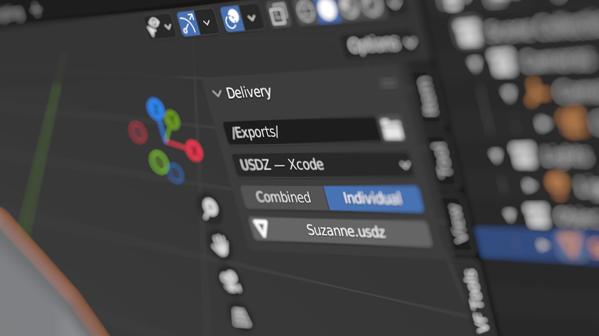
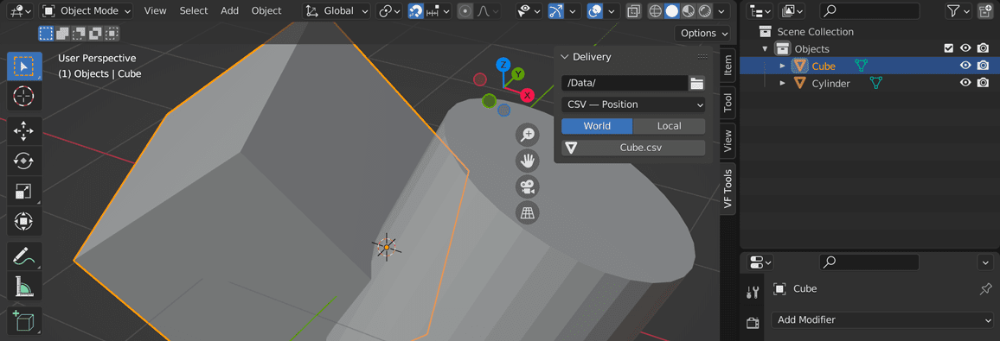

# VF Delivery

Export shortcuts for specific production pipelines. Includes presets for Unity 3D (FBX), ThreeJS (compressed GLB), Element3D (OBJ), Xcode (USDZ), 3D printing (STL with multi-object output), 3d texture strips (Unity VF, PNG, EXR), and data visualisation (CSV item and vertex position data).

## Installation and Usage

- Download [VF_delivery.py](https://raw.githubusercontent.com/jeinselen/VF-BlenderDelivery/main/VF_delivery.py)
- Open Blender Preferences and navigate to the "Add-ons" tab
- Install and enable the add-on
- It will show up in the 3D view `VF Tools` tab
- Select one or more objects to export, or a collection to export the contents
- Choose one of the presets and export

## Settings

- `Delivery Location`
	- Folder where all exported files will be saved
	- **WARNING** — Files with the same name will be automatically overwritten _without notification_ (this plugin is built for a workflow where file names must remain consistent as they are replaced with iterative changes)
- `Pipeline` sets the export type, organised into groups by usage and file type
	- **Mesh (Realtime 3D)**
		- `FBX — Unity3D` implements settings for use in Unity3D
			- Transforms are baked with Y-up orientation
	
		- `GLB — ThreeJS` outputs files designed for use in ThreeJS
			- Compressed GLB files are great for download optimisation, but are poorly supported in many apps (don't be surprised if you can't easily preview them)
			- Textures will automatically be compressed to JPEG files, but the best results are when input textures are prepped ahead of time (Photoshop and [ImageOptim](https://imageoptim.com/mac) seem to be the best pairing)
	
		- `OBJ - Element3D` formatted for compatibility with VideoCopilot's Element 3D plugin in Adobe After Effects
			- Animations are ignored, only the current frame will be exported using the render settings of any modifiers
	
		- `USDZ - Xcode` creates zipped USD files for use with Apple platforms such as Xcode development
			- Textures must be in [PNG or JPG format](https://openusd.org/release/spec_usdz.html)
	
	- **Mesh (3D Printing)**
		- `STL — Printer` creates an individually named STL file for each selected object or each object within the selected collection
	
	- **Volume (3D Texture)**
		- The following export options assume a Y-up export orientation and depend on mesh data generated by [VF-PointArray](https://github.com/jeinselen/VF-BlenderPointArray) to function, see the [Volume Fields](https://github.com/jeinselen/VF-BlenderDelivery#volume-fields) section below for more details
		- `VF — Unity Volume Field` exports specially formatted point arrays to the Unity 3D texture format .vf for use as force fields in particle effects
			- This format is native to Unity 3D, but may cause issues on some target platforms; EXR may be preferred
	
		- `PNG — 3D Texture Strip` exports a 3D texture strip PNG file with normalised 0-1 range
			- `Range` sets the input values that will be remapped to 0-1
			- This format isn't ideal, but in special cases may work for compressed delivery and re-expansion to -/+ values in-engine
	
		- `EXR — 3D Texture Strip` exports a 3D texture strip in floating point EXR format for Unity 3D, Unreal Engine, Godot, and others
			- Image sizes are dependent on the dimensions of the point array created by VF Point Array and the required custom data saved with the mesh when generated
	
	- **Data (XYZ Positions)**
		- `CSV - Item Position` samples every frame within the scene rendering range and saves the position values to a plain text file in comma separated x,y,z value format
			- The results can be used to generate per-frame path data for use in other apps, or round-trip and imported as mesh data using [VF-PointArray](https://github.com/jeinselen/VF-BlenderPointArray)
	
		- `CSV — Point Position` samples every point in the selected mesh object and exports the positions to plain text x,y,z values
			- The results can be used with the Unity 3D Line Renderer using [CSV import](https://github.com/jeinselen/VF-UnityUtilityScripts/blob/main/Scripts/LineCSV.cs) to easily build 3D strokes in Blender with splines and other methodologies for use in realtime experiences
	

Available options are different for mesh, volume, and data export types

- **Mesh export options**
	- `Grouping` determines how multiple selections are handled for all mesh export types (not applicable to CSV data)
		- `Combined` exports all selected mesh objects into a single file with the output name determined by the active object (active object doesn't have to be a mesh, and will not be included in the export)
		- `	Individual` exports each selected mesh object as an individually named file
- **Data export options** (item positions only)
  - `Position` defines the world or local space of the exported data (exclusive to CSV data)
  	- `World` exports each frame of position data in world space (parent position and animation will be fully accounted for)
  	- `Local` exports each frame of position data in local object space (parent position and animation is irrelelvant)

- `Export`
	- The export button will update as objects or collections are selected, reflecting the name that will be used in the export file(s)
		- If one or more objects are selected, the active object will be used as the file name
		- If no objects are selected, the active collection will be exported, and the collection name will be used as the file name
		- For STL exports, separate files will be created for each selected object
		- For CSV exports, only one file can be exported at a time, and it's the active object that will be used as data source

## Volume Fields

Exporting a .vf (volume field) file for use in Unity 3D requires specific mesh and Geometry Node setups.

- The source mesh must be generated using the [VF-PointArray](https://github.com/jeinselen/VF-BlenderPointArray) plugin version 1.8 or newer
  - Array type should be set to Cubic Grid
  - Count inputs do not have to be strictly cubic (rectangular arrays work too), but the total number of points should not exceed 65,536
  - Radius: doesn't matter for exporting, but should be adjusted to match whatever scale you're using in Blender
  - Random radius, random rotation, polyline, and grounded options are irrelevant for volume field purposes and can be left unchecked
- The named attribute `field_vector` must be set for each vertex using Geometry Nodes
  - The template file is built around using an input curve to drive particle flows...but any kind of vector data can be used, from procedural noise to the nearest surface normal of multiple objects...the only limit is what can be created in Geometry Nodes
- The volume field object cannot have instances or other geometry effects, it must be a plain particle field
	- The template file includes visualisations (both a vector field and a particle simulation) that are linked to the primary object, making it easier to see the results of the Geometry Node processing

Download template file: [VolumeFieldTemplate.blend.zip](images/VolumeFieldTemplate.blend.zip)

## Known Limitations

- All selected `curve`, `mesh`, `metaball`, `surface`, and `text` objects will be included by default, but not all exporters support them to the same extent:
	- `ABC` format (though not included in the current version) will export `mesh` and `metaball` objects as meshes, while `curve` objects will only include the original curve (regardless of extrusion, bevel, or geometry nodes based conversion to a mesh), and `surface` and `text` objects will only be included as empty locators
	- `FBX` exports all elements as meshes, including converting non-meshed curves into point arrays using the curve sampling resolution (the line itself is lost, only the positions along that line are preserved)
	- `GLB` will export `curve` (if extruded, beveled, or converted to a mesh in Geometry Nodes as of Blender 3.5), `mesh`, `surface`, and `text` objects as meshes, but non-mesh `curve` objects and `metaball` objects will be included only as empty locators
	- `OBJ` exports all elements as meshes, except for `curve` objects without any mesh component (no extrusion, bevel, or geometry nodes conversion to a mesh) which are ignored entirely (the OBJ format doesn't support empty locators)
	- `USDZ` files only include basic mesh and metaball objects, all other object types, even mesh objects with geometry nodes, are replaced with empty locators
	- `STL` like the OBJ format, this exports all elements as meshes except for non-meshed curves (curve objects without any extrusion, bevel, or geometry nodes conversion to a mesh)
	- Because there may be situations where empty locators or ignoring unsupported elements may be the preferred result, no warning will be given for "unsupported" combinations of object type and export format
- Experimental conversion of Geometry Nodes named attributes into UV maps was a hacky workaround for versions of Blender prior to 3.5.x, and has been removed thanks to the gradual addition of native 2D Vector and UV support in Geometry Nodes
	- Using the `Store Attribute` node with a `2D Vector` data type, `Face Corner` domain, and `UVMap` attribute name will successfully export a UV map (tested with FBX, GLB, and OBJ formats)
	- As of Blender 3.5.0, using an Output Attribute with `Vector` data type, `Face Corner` domain, and setting the output field to `UVMap` in the modifier panel _does not work_ (tested with FBX, GLB, and OBJ formats)
- There are no plans to add significant customisation to the exports. This plugin is designed for specific pipelines at Vectorform, and if it doesn't fit your use case, the best option is to fork the project and make it your own
- This software is provided without guarantee of usability or safety, use at your own risk