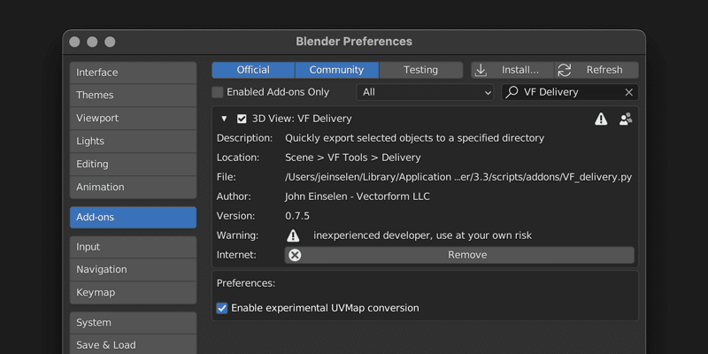

# VF Delivery

Export shortcuts for specific production pipelines. Supports Unity 3D (FBX), ThreeJS (compressed GLB) 3D printing (STL with multi-object output), and data visualisation (CSV position data).

## Installation and Usage
- Download [VF_delivery.py](https://raw.githubusercontent.com/jeinselenVF/VF-BlenderDelivery/main/VF_delivery.py)
- Open Blender Preferences and navigate to the "Add-ons" tab
- Install and enable the Add-on
- It will show up in the 3D view `VF Tools` tab
- Select one or more objects to export, or a collection to export the contents
- Choose one of the presets and export

## Settings

- `Delivery Location`
	- Folder where all exported files will be saved
	- **WARNING** — Files with the same name will be automatically overwritten

- `Pipeline`
	- `ABC - Static` exports a non-animated Alembic file from frame 0
	- `FBX — Unity3D` implements settings ideal for use in Unity3D
	- `GLB — ThreeJS` outputs files designed for use in ThreeJS (note that compressed GLB files are great for download optimisation, but are poorly supported in many apps)
	- `STL — Printer` creates an individually named STL file for each selected object or each object within the selected collection
	- `CSV - Position` samples every frame within the scene rendering range and saves the position values to a plain text file in comma separated value format
- Available options are different for mesh (FBX, GLB, etcetera) and data (CSV) export types
	- `Grouping` determines how multiple selections are handled for all mesh export types (not applicable to CSV data)
		- `Combined` exports all selected mesh objects into a single file with the output name determined by the active object (active object doesn't have to be a mesh, and will not be included in the export)
		- `	Individual` exports each selected mesh object as an individually named file

	- `Position` defines the world or local space of the exported data (exclusive to CSV data)
		- `World` exports each frame of position data in world space (parent position and animation will be fully accounted for)
		- `Local` exports each frame of position data in local object space (parent position and animation is irrelelvant)

- `Export`
	- The export button will update as objects or collections are selected, reflecting the name that will be used in the export file(s)
		- If one or more objects are selected, the active object will be used as the file name
		- If no objects are selected, the active collection will be exported, and the collection name will be used as the file name
		- For STL exports, separate files will be created for each selected object
		- For CSV exports, only one file can be exported at a time, and it's the active object that will be used as data source

### Experimental

- `Convert UVMap Attribute` will only appear in the main interface if `Enabled experimental UVMap conversion` is checked in the Blender Preferences
	- **WARNING** — This is potentially dangerous! The undo sequence after processing each file may mess something up and you could lose critical project data if it fails to complete correctly and the project is saved with objects that no longer have editable modifiers
	- This option enables _experimental_ UVMap support for named attributes; it loops through every selected object and applies all modifiers, converting the "UVMap" named attribute into an actual UV map that can be seen by file exporters
	- This known Blender limitation (3.3.x and previous) has been discussed in the developer portal page [T85962](https://developer.blender.org/T85962) with progress tracked in page [D14365](https://developer.blender.org/D14365)

- Requirements to use this feature:
	- The object(s) being exported must have a geometry node modifier that preserves or outputs a named attribute called `UVMap` containing vec2 or vec4 data (only the first two values will be retained; Blender does not support 4-channel UV maps like Unity)
	- The `UVMap` named attribute must be the default active (first and most likely only) attribute post-application of all modifiers (it may need to be the _only_ named attribute depending on how they sort)
	- Objects cannot share the same mesh resource with another object, as it will prevent automated application of modifiers

UVMap example file: [experimental-uvmap-conversion.blend.zip](https://github.com/jeinselenVF/VF-BlenderDelivery/raw/main/files/experimental-uvmap-conversion.blend.zip)

## Known Limitations

- There are no plans to add significant customisation to the exports. This is designed for specific pipelines at Vectorform, and if it doesn't fit your use case, the best option is to fork it and make it your own
- Experimental conversion of Geometry Nodes named attributes into UV maps really is a hacky workaround that doesn't even have proper Python API support, making it all the more difficult to implement reliably; the best option is to wait for Blender 3.4 or later to implement fully compatible UV data support across the board (from modelling and Geometry Nodes through all the export extensions)
- This software is provided without guarantee of usability or safety, use at your own risk