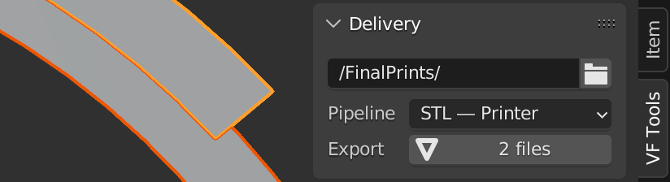
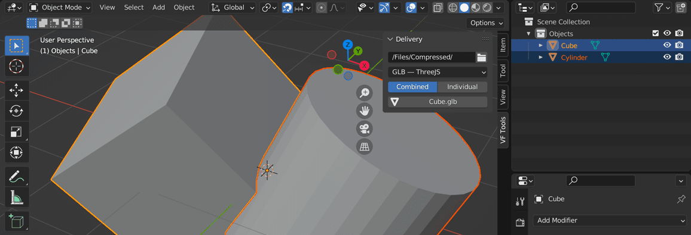
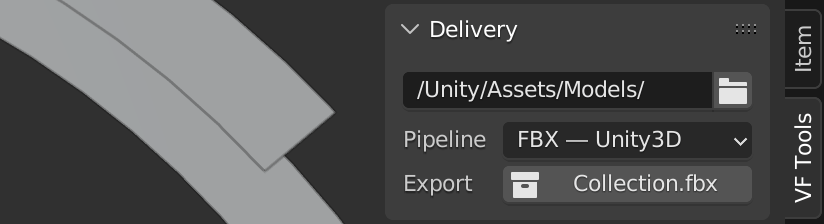

# VF Delivery

Export shortcuts for specific production pipelines. Supports Unity 3D (FBX), ThreeJS (compressed GLB), and 3D printing (STL with multi-object output).

## Installation and Usage
- Download [VF_delivery.py](https://raw.githubusercontent.com/jeinselenVF/VF-BlenderDelivery/main/VF_delivery.py)
- Open Blender Preferences and navigate to the "Add-ons" tab
- Install and enable the Add-on
- It will show up in the 3D view `VF Tools` tab

## Settings

`Delivery Location`
- Folder where all exported files will be saved

`Pipeline`
- `FBX — Unity3D` implements settings ideal for use in Unity3D
	- This also includes a very poorly designed hack to enable Geometry Node UV support, which relies on applying all modifiers, then converting an attribute into UV data
	- UV data must be output as a vec4 named "UVMap" and will need to be the first (and likely only) named attribute that's output from the Geometry Node
	- The known Blender limitation of no UV support in Geometry Nodes (as of 3.2.x) is discussed in more detail in the [developer portal T85962](https://developer.blender.org/T85962)
	- And after all this...it may not undo the steps properly, and could permanently lose critical data if you don't notice the modifiers weren't restored, and save over your project without live modifiers
	- Seriously, this is _so incredibly bad_
	- Please don't use this tool, I accept no responsibility for lost work
- `GLB — ThreeJS` outputs files designed for use in ThreeJS
	- Note that compressed GLB files may be good for faster loading, but are unsupported in many tools
- `STL — Printer` creates an individually named STL file for each selected object
	- This only works with selected mesh objects, and doesn't support selection by active collection

`Export`
- The export button will update as objects or collections are selected, reflecting the name that will be used
	- If one or more objects are selected, the active object will be used as the file name
	- If no objects are selected, the active collection will be exported, and the collection name will be used as the file name

## Known Limitations

- There are no customisations; this is designed for specific pipelines, and if it doesn't fit yours, the best suggestion is to fork it and make it your own
- Geometry Nodes UV "support" is a _terrible_ joke...it's a hacky workaround that doesn't even have proper Python API support, making it all the more difficult to implement
- No guarantee of usability is provided, and no responsibility is assumed